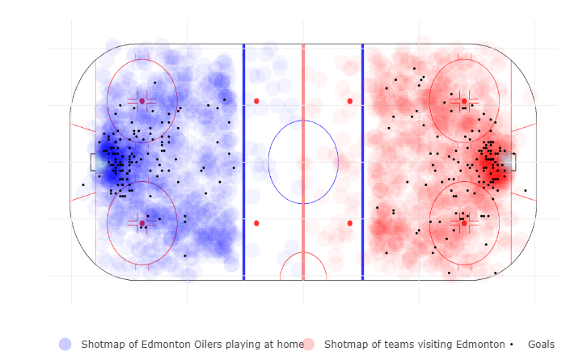
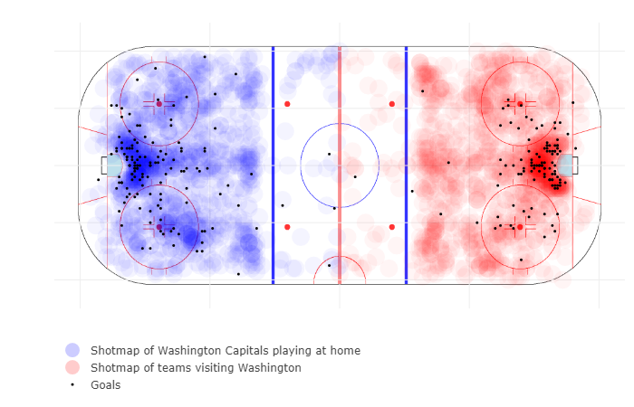
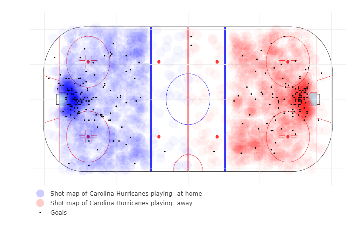
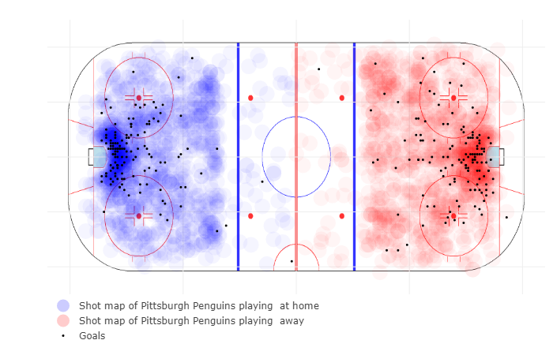

```{r setup, include=FALSE}
knitr::opts_chunk$set(warning = FALSE, message = FALSE)
```

```{r}
# Initializing code for report

# Loading packages
library(data.table)
library(ggplot2)
library(forcats)
library(stringr)
library(lubridate)

# Loading data
load('../data/2019-12-07_nhl-cleaned-data.RData')

# Setting up supporting functions for plots
plot_theme <- theme_minimal(12) +    
  theme(axis.text.y = element_text(size = rel(1)),
        axis.ticks.y = element_blank(),
        panel.grid.major.x = element_blank(),
        panel.grid.major.y = element_line(size = 0.5),
        panel.grid.minor.x = element_blank())

caption_source <- labs(caption="Note: data from regular season games\nSource: NHL.com API")

mid_line <- geom_hline(yintercept=.5)
```

## Introduction

### Background and research questions

Home team advantage is a common phenomenon in sports. Intuitively, we expect a team to perform better in their home arena. They are used to that location, have their fans to support them, don’t need to travel to it, etc.

But what does it really mean to have an advantage? Looking below the level of wins and losses, what happens to teams when they are at home and away? Does their style of play change? Are there some places that are harder to play at than others? Are there teams that perform better when away compared to others?

For our project, we explored these questions for ice hockey games in the National Hockey League (NHL). In recent years, the NHL has started tracking where and when events (like shots and goals) happen during the game. This provides a new opportunity to explore the game differently. Not only can we examine high-level game information, but we can also look at play-level details like where events occur on the ice.

This project consists of the following report, which focuses on high level views of the data and our overall findings. We have also developed an interactive shiny app to allow the reader to explore more granuolar views of the data to supplement this analysis.

All code used for the project is availabe on the github page: https://github.com/samrat-halder/Ice-Hockey.

### What you need to know about hockey to understand this

If you are familiar with the sport, feel free to skip this section. For those unfamiliar with the sport, we provide a brief overview of the relevant information on hockey and the NHL to be able to understand this report.

Ice hockey is a sport where each team has 6 players: 5 skaters and 1 goalie. Teams play 3 periods, each taking 20 minutes. The team with the most goals at the end wins. On average, teams score 2-3 goals per game.

For reference, here are the main types of plays in hockey (these are the ones recorded by the NHL).

Offensive plays

  * Goal: where one team scores
  * Shot: where a team shoots the puck on goal
  * Missed shot: where a team shoots the puck but misses the goal

Defensive 

  * Blocked shot: where a team shoots the puck, but the other team blocks it before it reaches the goal
  * Takeaway: when a team takes the puck away from the other team
  * Hit: when one player hits another (it's allowed and all players wear protective gear!)

Other

  * Penalty: where a foul is called on a team (following a penalty, that team plays with one less player for a short period of time)
  * Giveaway: when a team loses the puck
  * Faceoff: these events start a play and happen in 9 fixed locations on the ice (similar to a tip off in basketball)
  
For more information, check out the wikipedia page for ice hockey: https://en.wikipedia.org/wiki/Ice_hockey.

The NHL is the professional hockey league in the United States. It consists of 31 teams (30 before 2017) that each play 82 games per year. Each team plays half of their games at home and half at other teams’ arenas. (See the wikipedia page for more info: https://en.wikipedia.org/wiki/National_Hockey_League).

## Data sources

We collected our data directly from the NHL.com API. The NHL makes available all statistics and game data that they track. Game level data is recorded by each arena (like the coordinates of each play). While there are some static datasets avaiable online, we chose to pull our data directly from the API to have more over what information we could use.

While there is no formal documentation for this API, there is an online community that has documented some of the available endpoints (https://gitlab.com/dword4/nhlapi). From there, we sifted through the information returned by these calls to find the information we were looking for.

We gathered game data for all regular season games for the seasons in 2014-2018. This data consists of general information about the games (6232 total games) such as which teams played, who won, how many shots, where it was, etc. Additionally, we collected play-level data of each major event in the game. This includes the location, team, players, and more of each play in each game for events like goals, shots, penalties, etc. This is the primary 
data set for our project, consisting of (~1.6M events).

This dataset includes background info for each play, like the game id (discrete), when it happened during the game (continuous), team id (discrete), and location data (continuous).

One issue with this dataset is how the play-level data is recorded. Since this is performed by each arena independently, locations could be recorded slightly differently in different places. That said, our analysis does not depend on hyper-local analysis of coordinates so this does not present a challenge for us.

## Data transformation

To interact with the API, we used the httr package to make requests and the jsonlite package to parse the raw json data. From there, it was a matter of sifting through the raw data to extract the desired information and convert to data frames. Next, we had to convert the variables into appropriate data types (readr::type_convert was a really useful tool).

The final step was to standardize the coordinates of plays. During hockey games, the teams switch sides after every period. Therefore, if you want to look at all of a teams shots during one game, you need to standardize the orientation of their shots. We created multiple sets of coordinates (for example we made one with all shots on the left side of the rink), so that we could pick the right set for each visualization.

To recreate this dataset, visit our github for the project and use script "2019-12-06_nhl-api-script.R". The data itself is also directly available in the RData file "2019-12-07_nhl-cleaned-data.RData". (Both of these files are in the data folder: https://github.com/samrat-halder/Ice-Hockey/tree/master/data)

## Missing values

Missing data has been a challenge for us, particularly given the lack of formal documentation for the NHL API. For example, we are focusing on play-level data; however, some games are missing all records of these (see plot 1 below). Unfortunately, we cannot resolve this particular issue so will have to focus our analysis on the existing records. Fortunately, this accounts for a very small percentage of the games (<2%) so should not impact our analysis.

Looking at the proportion of games missing data by week of the season for each season, there are no discernible trends that would impact our analysis. In 2015, there are a couple weeks with relatively high levels of missing data, but this is not too concerning. Overall, it looks like the NHL is improving its data integrity; in 2018, the number of games missing data is almost 0, which is great news for incorporating future game data.

```{r}

missing_DT <- copy(vF_no_play_data)
missing_DT[,season := as.integer(substr(game.id,1,4))]
missing_DT[,game_num := as.integer(substr(game.id,7,10))]
missing_DT[,game_group := cut(game_num,breaks=28,labels=F)] # 28 weeks in a season

ggplot(missing_DT[,.(prop=sum(no.data)/.N),by=.(season,game_group)]) +
  geom_line(aes(x=game_group,y=prop)) +
  scale_x_continuous(limits = c(1,28), breaks=seq(1,28,4)) +
  scale_y_continuous(labels=scales::percent_format(2)) +
  labs(title="Proportion of games missing play-level data (2014-18)"
       ,x="Week of season"
       ,y="Proportion of games") +
  caption_source +
  facet_grid(rows=vars(season)) +
  plot_theme
```

An even stranger occurrence is that all of the data for one game (both high level and the play data) disappeared from the API over the course of our usage of it! Luckily, only 1 game is missing over the course of 5 seasons so it is not a major issue.

Another area of missing data arises naturally from the data we are using. Some information is specific to the type of play. For example, the information recorded for a shot (shooter, shot type) is different from the info recorded for a hit (hitter, hittee) or a penalty (severity, type). This did not affect our analysis too much as we did not focus on this information.  

## Results

### Overview of findings

In the NHL, ~55% of games are won by the home team. While the home team has a clear advantage, the degree of it varies by team. (Even if a really good team is playing away, they still are likely to be the better team.) Digging in to the play-level data, we see that home team advantage exists across almost all types of plays. Not only do teams shoot and score (and thus win) more when they are the home team, they also are penalized less. Perhaps fans yelling at the referee does have some effect!

**Hardest places to play:** Anaheim and Washington

**Easiest places to play:** Ottowa and Edmonton 

**Best teams when playing away:** Carolina Hurricanes and New Jersey Devils

**Worst teams when playing away:** Pittsburgh Penguins and Calgary Flames

### How big of an advantage do home teams really have?

Overall, home teams have a significant advantage, winning ~55% of the time. This advantage has been consistent over the time period of this analysis.

```{r}
overall_win_perc_HoA_by_season <- vF_game_info[,.(h=sum(home.win),a=sum(away.win)), by = season
                             ][,.(season,home=h/(h+a),away=a/(h+a))]

ggplot(melt(overall_win_perc_HoA_by_season, id.vars='season', variable.name='HoA', value.name='win_perc')) +
  geom_point(aes(x=season,y=win_perc,color=HoA)) +
  mid_line +
  labs(title = "NHL home vs away win-percentage (2014-18)"
       ,x = "Season"
       ,y = "Win percentage"
       ,color = element_blank()) +
  caption_source +
  scale_y_continuous(limits = c(.4,.6), labels = scales::percent_format(1)) +
  plot_theme
```

Looking across teams, we see a significant variation in this performance. For example, the Tampa Bay Lightning win almost 70% of their home games and 55% of their away ones. In general, teams that perform better at home also perform better on the road. However, we do see a big difference in the how much better teams perform when they are home vs. away. The San Jose Sharks (shown in the middle) have very small difference while the Philadelphia Flyers have a massive one (almost 20%).

```{r}
team_win_perc_HoA <- vF_game_teams_stats[,.(win_perc=sum(won)/.N),by=.(team.id,HoA)]

ggplot(merge(team_win_perc_HoA, vF_teams_DT[,.(team.id,long.name)], by='team.id')) +
  geom_point(aes(x=reorder(long.name,win_perc*(HoA=='home')),y=win_perc,color=HoA)) +
  mid_line +
  labs(title = "Home vs away win-percentage by team (2014-18)"
       ,x=element_blank()
       ,y="Win percentage"
       ,color=element_blank()) +
  caption_source +
  scale_y_continuous(limits = c(.3,.7), labels = scales::percent_format(1)) +
  plot_theme +
  theme(axis.text.y = element_text(size=rel(.75))) +
  coord_flip()
```

Clearly we need to account for this variation in team-strength. As we dig below the level of wins and losses, we will also explore metrics that adjust for this.

### What does home team advantage look like for different types of plays?

A simple view of what percentage of plays are recorded for the home team highlights how the home team plays better. On the defensive side, home teams have more takeaways and hits. However, they block fewer shots, which could be explained by the fact that away teams shoot less. On the offensive side, home teams have a majority of the plays across all types. 

And lastly, the other category is a little more interesting. Fewer penalties are called on the home team (in this case <50% is better for the home team). Perhaps referees are less inclined to call a penalty when the entire stadium is yelling at them for it. Additionally, home teams give away the puck much more than away teams. 

```{r}
play_type <- data.table(result.eventTypeId=c('BLOCKED_SHOT','FACEOFF','GIVEAWAY','GOAL','HIT','MISSED_SHOT','PENALTY','SHOT','TAKEAWAY'),
type=c('Defensive','Other','Other','Offensive','Defensive','Offensive','Other','Offensive','Defensive'))
event_home_perc <- dcast(vF_game_plays[,.N,by=.(HoA,result.eventTypeId)], result.eventTypeId ~ HoA)[,.(result.eventTypeId,home_perc = H/(A+H))]

ggplot(merge(event_home_perc, play_type)) +
  geom_col(aes(x=reorder(str_to_sentence(result.eventTypeId),home_perc), y=home_perc)) +
  mid_line +
  labs(title = "Percentage of plays for the home team (2014-18)"
       ,x=element_blank()
       ,y="Home plays as a % of total") +
  caption_source +
  scale_y_continuous(labels = scales::percent_format(1)) +
  facet_grid(rows=vars(type), scales = "free_y", space = "free_y") +
  plot_theme +
  coord_flip()

```

But what does this look like when accounting for team strength? The boxplots below show how teams perform at home compared to away for all play types. This metric is calculated as 
$$\frac{\text{avg # plays when home per game} - \text{avg # plays when away per game}} {\text{avg # plays when away per game}}$$
This view provides a bit more nuance to the story. Some play types (like giveaways) have a large amount of variability as compared to goals, where all teams clearly perform better at home.

```{r}
plays_summary <- vF_game_plays[,.(rate_per_game = .N / length(unique(game.id))),by=.(team.id.for, HoA,result.eventTypeId)]

plays_home_delta <- dcast(plays_summary, team.id.for + result.eventTypeId ~ HoA)[,perc_delta := (H-A)/A]

ggplot(merge(plays_home_delta,play_type,by="result.eventTypeId")) +
  geom_boxplot(aes(x=reorder(str_to_sentence(result.eventTypeId),perc_delta,median), y=perc_delta)) +
  geom_hline(yintercept=0) +
  labs(title = "Difference in performance home vs. away (2014-18)"
       ,subtitle = "Each observation represents one team for that type of play"
       ,x=element_blank()
       ,y="Home performance relative to away performance") +
  caption_source +
  scale_y_continuous(limits=c(-.5,1.25), labels = scales::percent_format(1)) +
    facet_grid(rows=vars(type), scales = "free_y", space = "free_y") +
  plot_theme +
  coord_flip()
```

### What arenas are the hardest to play at?

To understand this question, we look at each arena and how other teams perform when they play there. We then compare this performance to that team's average away performance. The three hardest places to play are Anaheim, Washington, and Montreal. Interestingly, in a recent poll of NHL players, Nashville, Winnipeg, and Pittsburgh were ranked as the toughest places to play. While these three are in the top half, they are certainly not in the top 5. On the other side of the coin, Ottawa and Edmonton are the easiest places to play. This is not surprising given that over this time period these teams did not perform well in general

```{r}
play_sel <- 'GOAL'
avg_away_performance <- plays_summary[HoA=='A' & result.eventTypeId==play_sel, .(team.id.for, avg_rate = rate_per_game)]

away_performance_by_arena <- vF_game_plays[HoA=='A' & result.eventTypeId==play_sel
                                           ,.(rate_per_game = .N / length(unique(game.id))),by=.(team.id.for, team.id.against)][order(team.id.for,team.id.against)]

away_perf_comp <- merge(away_performance_by_arena, avg_away_performance)[, delta := rate_per_game/avg_rate-1]

away_perf_by_city <- merge(away_perf_comp[,mean(delta),by=team.id.against], vF_teams_DT[,.(team.id,venue.city)], by.x='team.id.against', by.y='team.id')

ggplot(away_perf_by_city) +
  geom_point(aes(x=reorder(venue.city,V1),y=V1)) +
  geom_hline(yintercept=0) +
  labs(title = "Away team performance by city (2014-18)"
       ,subtitle = paste0("Perfomance measured using ",str_to_lower(play_sel),"s")
       ,x=element_blank()
       ,y="Performance relative to avg away performance") +
  caption_source +
  # scale_y_continuous(limits = c(.3,.7), labels = scales::percent_format(1)) +
  plot_theme +
  theme(axis.text.y = element_text(size=rel(.75))) +
  coord_flip()
```

### Arena case studies 

In addition to this high level view, we can look at arena shot maps to better understand the difference between locations. In these plots, shots are displayed as a heatmap based on density at locations on the ice. On top of this, individual goals are overlaid as points. In general in hockey, shots closer to the net are better. Seeing a very dense area around the net for a team is good. Another pattern to note is that defensment typically shoot from the blue line. A lot of shots in this area indicates either the team has very active defensemen or that they struggle to get good chances from closer to the net.

Taking a team from the bottom and top, we compare the shotmaps at Edmonton and Washington. In Edmonton's shot map (which shows the Edmonton Oilers on the left and all visiting teams on the right), we do not see a great deal of difference between the home team and visiting teams. While Edmonton's shot map looks slightly denser around the net than visitors, the number of goals in this area is very similar. Meanwhile, there is a clear difference when looking at Washington's shot map. It is mcuh denser in front of the goal for Capitals. For visiting teams, there is a lot more shading near the blue line, indicating more shots are coming from the defensive players. This shows how the Capitals are forcing teams to shoot from farther away. 

One last aside on the Washington shot map: we can clearly see where Alex Ovechkin (one of the best players in the NHL) is shooting from for Washington by looking at the bottom dot on the left side of the plot. Ovechkin is known for setting up at this location and firing slapshots; indeed the shot density is darker and there are more goals here. 







### What teams are the strongest when on the road?

Earlier, we looked at win rates when teams are at home vs. away and noticed significant variation in the difference between home and away performance. We now look at this, using goals, while accounting for team strength. The Carolina Hurricanes, New Jersey Devils, and San Jose Sharks perform the best when away. Earlier we noticed the San Jose Sharks had a very small difference in home and away win percentage. But while the Carolina Hurricanes difference is small here, their home vs. away win percentage is much larger. (Of course, scoring goals is only half the battle in hockey!) 

And on the other side, the Pittsburgh Penguins perform the worst when away. This is interesting because they were a really strong team over this time period. But their overall home/away win percentages do reflect this.

```{r}
play_sel <- 'GOAL'

plays_away_delta <- dcast(plays_summary, team.id.for + result.eventTypeId ~ HoA)[,perc_delta := (A-H)/H]

team_away_perf <- merge(plays_away_delta,vF_teams_DT[,.(team.id,long.name)], by.x='team.id.for', by.y='team.id')

ggplot(team_away_perf[result.eventTypeId == play_sel]) +
  geom_point(aes(x=reorder(long.name,perc_delta),y=perc_delta)) +
  geom_hline(yintercept=0) +
  labs(title = "Away performance relative to home performance (2014-18)"
       ,subtitle = paste0("Perfomance measured using ",str_to_lower(play_sel),"s")
       ,x=element_blank()
       ,y="Away performance as a % of home performance") +
  caption_source +
  scale_y_continuous(labels = scales::percent_format(1)) +
  plot_theme +
  theme(axis.text.y = element_text(size=rel(.75))) +
  coord_flip()

```

### Team case studies: 

We can examine shotmaps for these teams to provide additional nuance to our understanding of these teams' performance; let's take the Carolina Hurricanes and Pittsburgh Penguins as a comparison. This time we use shot map for teams when they play at home (left) and away (right). Overall, there is not too much of a difference in the Hurricanes shot map, as expected. When playing away their shots are a bit more compact and slightly less dense, but they still generate a significant number of goals from in close. Meanwhile, the Penguins shot map looks completely different from left to right. At home, their shots are very dense around the net with a ton of goals. But when playing away, their shots and goals are pushed much farther away from the net. 





## Interactive component

Please go to https://edav-fall2019-jhs.shinyapps.io/ice-hockey/ to see our shiny app. Detailed information, like the charts in the case studies, is available here. You are free to select different teams, arenas, or even individual players to explore different shotmaps. Additional aggregate information and charts is also available.

## Conclusion

### Lessons learned

**High level analysis first:** It's important to start with aggregate data cuts to develop a sense for the data, understand what information you want to share, and guide the more granular data exploration. 

**Start small to build interactivity:** In building our shiny app, we had a ton of data to play with. It was important to start with one type of play for one game to understand the best way to display the information.

**Beware information overload:** Along the same line of thinking, we attempted to display information on all types of plays (e.g. shot and hits) on one plot; however, it was difficult to interpret. Once we focused on shots and goals, we were able to see clearer patterns.

### Future opportunities

**Holistic view of game:** Thus far, we have primarily focused our analysis on the offensive side of the game. One future area of research could take a more holistic view to better account for defense and goaltending. 

**Time sensitivity:** In this report, we analyzed aggregate data for teams over the course of 5 seasons. However, the relative strength of teams changes over time and so too could home vs. away performance.

**Player analysis:** We focused on team-level analysis, but we could go down to the player level to understand if certain players have particular strengths when at home vs. away.